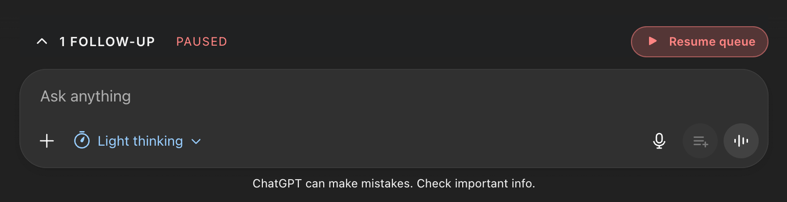
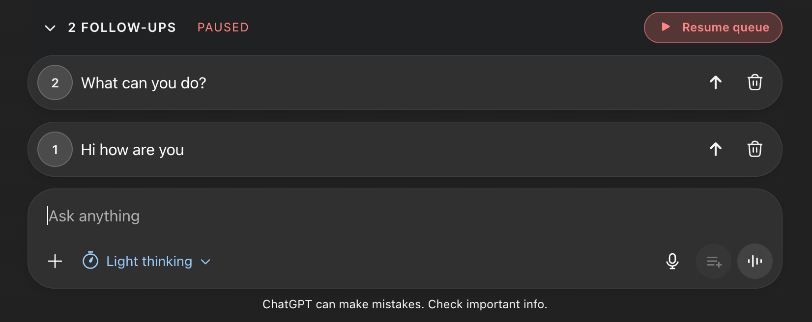

# chatgpt-queue

Queue prompts for ChatGPT and let them auto-send as soon as the previous reply finishes. The extension keeps long follow-up chains moving without babysitting the UI.

## Visual Preview

| Collapsed queue | Expanded queue |
| --- | --- |
|  |  |

## What It Does

- **Inline queue controls** - two buttons live next to the ChatGPT composer: *Add to queue* captures the current draft, while *Hold & queue* captures it and pauses the automation until you resume.
- **Attachment-aware entries** - when you queue something that contains pasted images or uploaded files, those attachments stay with the follow-up, display in the queue, and are re-applied before the item sends.
- **Model locking** - each queued follow-up remembers the ChatGPT model that was selected when it was captured, so mixed runs (e.g., GPT-4o followed by GPT-4.1) are replayed on the right model automatically.
- **Keyboard-first editing** - navigate with Option/Alt+Arrow keys, send with Enter, delete with Shift+Delete, or reorder via drag-and-drop or by typing a new queue position.
- **Persistent, local state** - items, attachments, collapsed state, and pause reasons live in `chrome.storage.local`, so a refresh or navigation keeps your queue intact.
- **Keyboard shortcut helper** - when you open ChatGPT's built-in `?` shortcut panel, the queue shortcuts are injected into that list for quick reference.

## Installation

### Chromium browsers (Chrome 133+, Edge, Brave, Arc)

1. Clone or download this repository.
2. Open `chrome://extensions` (Arc/Brave/Edge will redirect automatically) and switch **Developer mode** on.
3. Click **Load unpacked** and choose the nested `chatgpt-queue/` directory.
4. Keep Developer mode enabled so the unpacked extension stays active.

> Note: Chrome 133+ and its siblings now disable unpacked extensions unless Developer Mode remains on. Google announced the policy change in the [December 20, 2024 Chromium Extensions PSA](https://groups.google.com/a/chromium.org/g/chromium-extensions/c/cTdMVtxxooY), so make sure that toggle stays enabled while you develop or run chatgpt-queue.

### Firefox (temporary add-on)

1. Open `about:debugging`.
2. Select **This Firefox** -> **Load Temporary Add-on...**.
3. Choose `manifest.json`.
4. If your Firefox build lacks MV3 service workers, edit the manifest first so the background section uses `"scripts": ["bg.js"]`.

## Usage

### Queue prompts quickly

- Type in the ChatGPT composer, then either press **Option+Enter** (macOS) / **Alt+Enter** (Windows/Linux) or click the inline *Add to queue* button. The queue UI appears once you have at least one follow-up staged.
- To capture and pause in a single shot, use **Option+Cmd+Enter** / **Alt+Ctrl+Enter** or click *Hold & queue*. The queue stays paused until you hit **Resume queue** or the same shortcut again.

### Edit, reorder, and send

- Every follow-up sits in its own card with a text area. Edit inline; changes persist automatically.
- Drag cards to reorder, or type a new position number into the left-hand index field.
- Use the arrow button on any card to send it immediately, even if the rest of the queue is paused.
- Shift+Delete removes the focused card with a confirmation, and Option/Alt+Shift+Delete removes it instantly.

### Attachments

- When you queue a prompt that already has pasted screenshots or uploaded files, the extension captures those attachments and shows thumbnails inside the queue card.
- Paste images directly into a queue card to add more attachments later. Use the **Remove** button on a thumbnail to drop it from that follow-up.
- Attachments automatically clear from the ChatGPT composer once the follow-up is queued and reattach themselves when that follow-up runs.

### Model locking

- Whatever ChatGPT model (GPT-4o, GPT-4.1, o1-mini, etc.) is active when you queue a follow-up is stored with that item.
- When the queue dispatches that item, it opens the model picker, selects the stored model, reapplies the prompt and attachments, and only then sends. Mixed-model runs no longer require manual babysitting.
- If the model picker layout changes, open the model menu once so the queue script can learn the latest entries before replaying.

### Running & visibility

- The queue auto-dispatches whenever it has items, the composer is idle, and the queue is not paused. You can pause/resume from the header button or with **Shift+Cmd/Ctrl+P**.
- The header collapse button (or **Shift+Cmd/Ctrl+.**) hides the card list but keeps the inline status visible. Click the Chrome toolbar icon to force the panel open if you collapsed it earlier.
- Auto-dispatch waits until ChatGPT's stop button disappears and the composer is clear, then enforces a short cooldown before sending the next item.

## Keyboard shortcuts

| Action | macOS | Windows/Linux |
| --- | --- | --- |
| Queue current input | Option+Enter | Alt+Enter |
| Queue current input & pause | Option+Cmd+Enter | Alt+Ctrl+Enter |
| Navigate queue items | Option+Up / Option+Down | Alt+Up / Alt+Down |
| Send focused follow-up | Enter | Enter |
| Delete focused follow-up (confirm) | Shift+Delete | Shift+Delete |
| Delete focused follow-up (without confirmation) | Option+Shift+Delete | Alt+Shift+Delete |
| Collapse/expand queue list | Shift+Cmd+. | Shift+Ctrl+. |
| Pause/resume queue | Shift+Cmd+P | Shift+Ctrl+P |

Browser-level commands (set from `chrome://extensions/shortcuts`) include **Queue current input** with a default of **Cmd+Shift+Y** (macOS) / **Ctrl+Shift+Y** (Windows/Linux).

## Persistence & data

All queue content, attachments, and the paused/collapsed state live in `chrome.storage.local`. Nothing leaves the browser, so you can refresh or navigate without losing your run. As always, review the terms of service for any site you automate before unleashing a queue.

## Development

Project structure:

- `chatgpt-queue/manifest.json` - MV3 manifest and permissions.
- `chatgpt-queue/bg.js` - Background service worker relaying keyboard commands and toolbar clicks.
- `chatgpt-queue/content.js` - Queue UI, automation logic, attachment handling, and model selection.
- `chatgpt-queue/bridge.js` - ProseMirror helper that reliably replaces the ChatGPT composer content.
- `chatgpt-queue/styles.css` - Styling for the floating queue and inline buttons.

Workflow:

1. Make your edits inside the `chatgpt-queue/` directory.
2. Visit `chrome://extensions`, click **Reload** on the unpacked entry, and refresh your ChatGPT tab.
3. Watch DevTools for selector warnings if the ChatGPT UI changes; update `SEL.*` in `content.js` whenever necessary.

## Troubleshooting

- **Panel never shows up** - queue at least one follow-up first; the UI stays hidden when the queue is empty.
- **Send button never fires** - inspect the page, verify the selectors in `SEL.editor`, `SEL.send`, and `SEL.stop`, and adjust them to match ChatGPT's current markup.
- **Attachments reappear in the composer** - another extension may intercept `beforeinput` events. Disable conflicting extensions or rely on the fallback `execCommand('insertText')` path.
- **Model won't change** - open the ChatGPT model picker once so the queue can parse the latest menu entries. Reload the extension afterward if needed.
- **Unpacked extension disappears** - ensure Developer mode is still toggled on in `chrome://extensions`; Chromium browsers now disable unpacked extensions when that toggle is off.

## License

`chatgpt-queue` is distributed under the terms of the GNU General Public License v3.0. See [LICENSE](LICENSE) for details.
